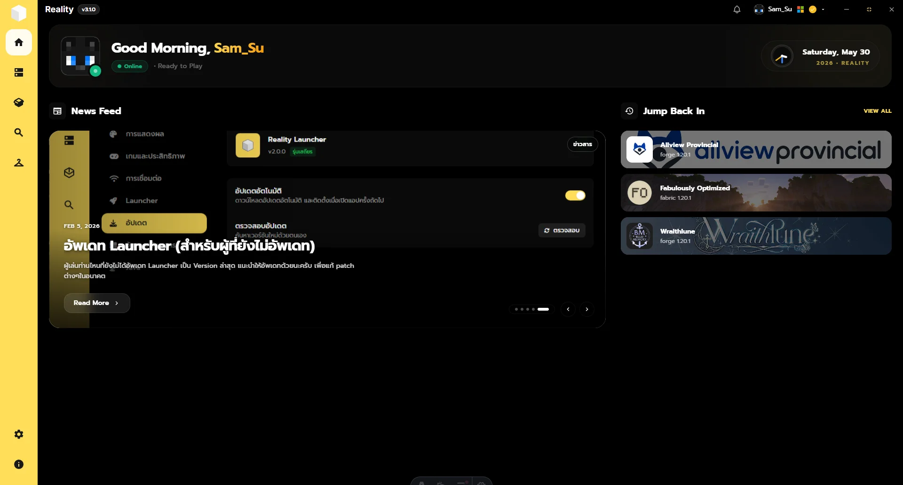
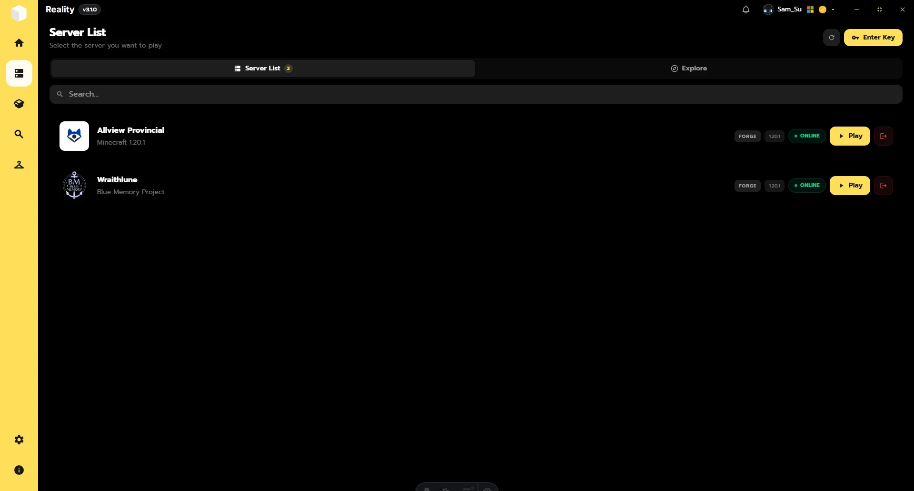
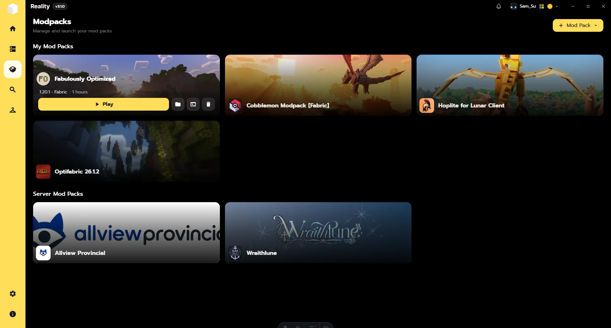
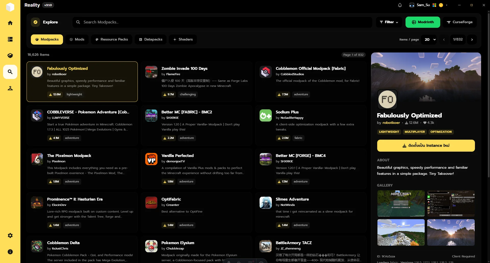
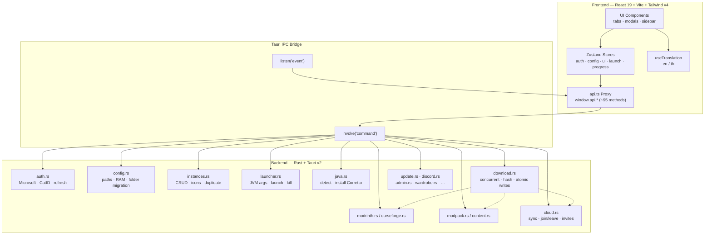

<div align="center">


# Reality Launcher

**A modern, lightweight Minecraft launcher — built with Tauri v2, React 19, and Rust.**

Native performance. Tiny footprint. Full modpack, cloud sync, and skin support.

[](./LICENSE)
[](https://github.com/catlab-design/realitylauncher-client/releases/latest)
[](#-installation)
[](https://v2.tauri.app)
[](https://react.dev)
[](https://www.rust-lang.org)
[](https://bun.sh)

</div>

---

Unlike the legacy Electron client (`ml-client-old`), Reality Launcher runs on **Tauri v2** and your system's native WebView — for significantly faster startup, a much smaller installation footprint, and a native Rust backend handling everything OS-related.

|  |
|:---:|
| *Home dashboard — news feed, recent instances, live clock* |

---

## ✨ Features

- 🔐 **Dual Authentication** — Microsoft account (device code flow) + CatID (custom OAuth), with automatic token refresh
- 📦 **Modpack Management** — Create vanilla / Forge / Fabric / NeoForge / Quilt instances, import `.mrpack` & CurseForge packs, duplicate, version-switch
- 🔍 **Modrinth + CurseForge Explorer** — Search mods, resourcepacks, shaders & datapacks; install straight into any instance
- ☁️ **Cloud Sync** — Join community server instances; mods auto-sync with hash verification and 404-resilient downloads
- 👗 **Wardrobe** — 3D skin preview (skinview3d) with upload/apply via Minecraft profile or CatSkinC
- 📜 **Live Logs** — Real-time game output streaming with pause/tail
- 🔄 **Auto-Updater** — In-app update check, background download, one-click install & restart
- ⚡ **Resilient Download Engine** — Concurrent (semaphore-based), SHA1/256/512 verified, atomic writes, retry with backoff
- 🎨 **Theming & i18n** — Multiple color themes (incl. rainbow mode), English + Thai
- 💬 **Discord Rich Presence** — Show what you're playing

## 📸 Screenshots

| Home | Servers |
|:---:|:---:|
|  |  |
| **ModPack** | **Explore** |
|  |  |

## 🚀 Installation

### Pre-built Binaries

Grab the latest installer from [**Releases**](https://github.com/catlab-design/realitylauncher-client/releases/latest):

| Platform | Artifact | Notes |
|----------|----------|-------|
| **Windows** | `.exe` / `.msi` | WebView2 required (bundled on Win 10/11) |
| **macOS** | `.dmg` | Universal (Intel + Apple Silicon) |
| **Linux** | `.AppImage` / `.deb` / `.rpm` | Requires `webkit2gtk-4.1` |

> ℹ️ Releases are published manually — check the releases page to make sure you're on the newest build.

> ⚠️ **macOS users:** builds are currently unsigned, so Gatekeeper may show
> *"App is damaged"* or *"can't verify the developer"* on first launch
> (Intel & Apple Silicon). One-time fix:
>
> 1. Open **Terminal**
> 2. Paste (adjust the path if you didn't install to `/Applications`):
>    ```bash
>    sudo xattr -cr "/Applications/Reality Launcher.app"
>    ```
> 3. Enter your login password when prompted
> 4. Launch normally
>
> No-Terminal alternative: right-click the app → **Open**, or
> System Settings → Privacy & Security → **Open Anyway**.

### From Source

**Prerequisites**

| Tool | Version | Install |
|------|---------|---------|
| [Bun](https://bun.sh/) | 1.x | `curl -fsSL https://bun.sh/install \| bash` |
| [Rust](https://rustup.rs/) | stable | `curl --proto '=https' --tlsv1.2 -sSf https://sh.rustup.rs \| sh` |
| WebView | per OS | See [Tauri prerequisites](https://v2.tauri.app/start/prerequisites/) — Edge WebView2 (Windows), built-in WebKit (macOS), `webkit2gtk-4.1` (Linux) |

```bash
git clone https://github.com/catlab-design/realitylauncher-client.git
cd realitylauncher-client
bun install

# Development — Vite HMR + Rust auto-rebuild in a native window
bun run tauri dev

# Production build → src-tauri/target/release/bundle/
bun run tauri build
```

## 🏗 Architecture

React owns the UI; Rust owns everything touching the OS. They communicate over Tauri IPC (`invoke` commands + emitted events).



**Key backend pieces**

| Module | Role |
|--------|------|
| `download.rs` | Shared concurrent engine — semaphore concurrency, retry w/ backoff, SHA1/256/512 verification, atomic temp+rename writes, JAR/ZIP validation |
| `op_guard.rs` | Exclusive/shared operation guard — prevents installs, migrations, and launches from racing each other |
| `http_client.rs` | Global pooled `reqwest::Client` (HTTP/2, gzip, brotli) |
| `launcher.rs` | Largest module — full game launch pipeline: classpath/JVM args, natives, mod loaders, process tracking |
| `config.rs` | Atomic config/session persistence with corruption backups (`*.bak-*`) and crash-safe defaults |

## ⚙️ Configuration

Config lives at:

| OS | Path |
|----|------|
| Windows | `%APPDATA%\net.catlab.reality-launcher\` |
| macOS | `~/Library/Application Support/net.catlab.reality-launcher/` |
| Linux | `~/.config/net.catlab.reality-launcher/` |

- `config.json` — launcher settings (atomic writes; unreadable files kept as `*.bak-<timestamp>` before overwrite)
- `session.json` — auth tokens (auto-refreshed; never exposed to the webview)

Notable settings: `minecraft_dir` (game data folder, migratable in-app with progress/cancel), `ramMB` (auto-detected max), `java_path`, `theme`, `language`, `closeOnLaunch`, `discordRpcEnabled`, `autoUpdateEnabled`.

The client talks to the Reality backend API (`api.reality.catlabdesign.space`) for auth, cloud sync, servers, news, and updates.

## 🛠 Development

```bash
bun install              # install dependencies

bun run tauri dev        # full dev environment (HMR + Rust rebuild)
bun run build            # frontend production build only
bun test                 # bridge parity tests (bun:test)
bun run check:bridge     # TypeScript typecheck of the IPC bridge
cargo check --lib        # Rust compile check (run inside src-tauri/)
```

**Bridge parity testing** (`src/api.test.ts`) enforces that:
1. Every `invoke('command')` in `src/api.ts` exists as a `#[tauri::command]` in Rust
2. Every `window.api.X()` call from components is defined on the proxy
3. The "known unported" allowlist stays honest — implemented methods must be removed from it

Before opening a PR: `cargo check --lib`, `bun test`, `bun run check:bridge`, and `bun run build` should all pass.

## 📁 Project Structure

```text
realitylauncher-client/
├── docs/
│   ├── CHANGELOG.md             # release history
│   ├── plans/                   # migration plans (Electron → Tauri)
│   └── assets/                  # screenshots, logo, demo GIF
├── src/                         # React frontend
│   ├── main.tsx                 # entry point
│   ├── api.ts                   # Tauri IPC proxy (window.api)
│   ├── api.test.ts              # bridge parity tests
│   ├── components/
│   │   ├── LauncherAppShell.tsx # titlebar + sidebar + content shell
│   │   ├── tabs/                # Home, ModPack, Explore, Wardrobe, …
│   │   │   ├── ExploreTabs/     # Modrinth/CurseForge browser
│   │   │   ├── ModPackTabs/     # instance management
│   │   │   └── settingsTabs/    # settings dialog pages
│   │   └── ui/                  # reusable primitives (Portal, SmartImage, …)
│   ├── store/                   # Zustand stores (auth & config persisted)
│   ├── i18n/                    # translations-en.ts / translations-th.ts
│   ├── hooks/                   # useTranslation, useInstances, useGameEvents
│   ├── lib/                     # utils, sounds, MS login flow, policies
│   └── styles/global.css        # Tailwind v4 import + custom animations
└── src-tauri/                   # Rust backend
    ├── tauri.conf.json          # window config, bundle targets
    ├── capabilities/default.json# security permissions
    ├── config/                  # bundled MC optimization configs
    └── src/
        ├── main.rs              # entry — 93+ command registrations
        ├── download.rs          # shared concurrent download engine
        ├── launcher.rs          # game launch pipeline
        └── …                    # see Architecture table above
```

## 🤝 Contributing

Contributions are welcome! Read [CONTRIBUTING.md](./CONTRIBUTING.md) for setup steps, coding standards (strict TypeScript, no redundant comments, declarative style), and PR guidelines.

Please also review our [Code of Conduct](./CODE_OF_CONDUCT.md).

Found a security vulnerability? **Do not open a public issue** — see [SECURITY.md](./SECURITY.md).

## 💬 Community

- 🐛 [Issue Tracker](https://github.com/catlab-design/realitylauncher-client/issues) — bug reports & feature requests
- 💬 Discord server — *coming soon*

## 📄 License

Distributed under the [GPL-3.0-only](./LICENSE) license.

```
Reality Launcher
Copyright (C) 2026 SpaceLogic Studio <hi@catlabdesign.space>

This program is free software: you can redistribute it and/or modify
it under the terms of the GNU General Public License as published by
the Free Software Foundation, either version 3 of the License, or
(at your option) any later version.
```

## 🙏 Acknowledgments

| Project | Role |
|---------|------|
| [Tauri](https://v2.tauri.app) | Native desktop framework |
| [React](https://react.dev) | UI library |
| [Zustand](https://github.com/pmndrs/zustand) | State management |
| [skinview3d](https://github.com/bs-community/skinview3d) | 3D Minecraft skin rendering |
| [Modrinth API](https://docs.modrinth.com) | Mod content metadata |
| [CurseForge API](https://docs.curseforge.com) | Modpack/mod hosting |
| [minecraft-msa-auth](https://crates.io/crates/minecraft-msa-auth) | Microsoft login crate |
| [Prompt](https://fonts.google.com/specimen/Prompt) & [Inter](https://rsms.me/inter/) | Self-hosted fonts via @fontsource |
| `ml-client-old` (Electron) | Feature reference for the migration |

---

<div align="center">

**Made with ❤️ by [SpaceLogic Studio](mailto:hi@catlabdesign.space)**

</div>
